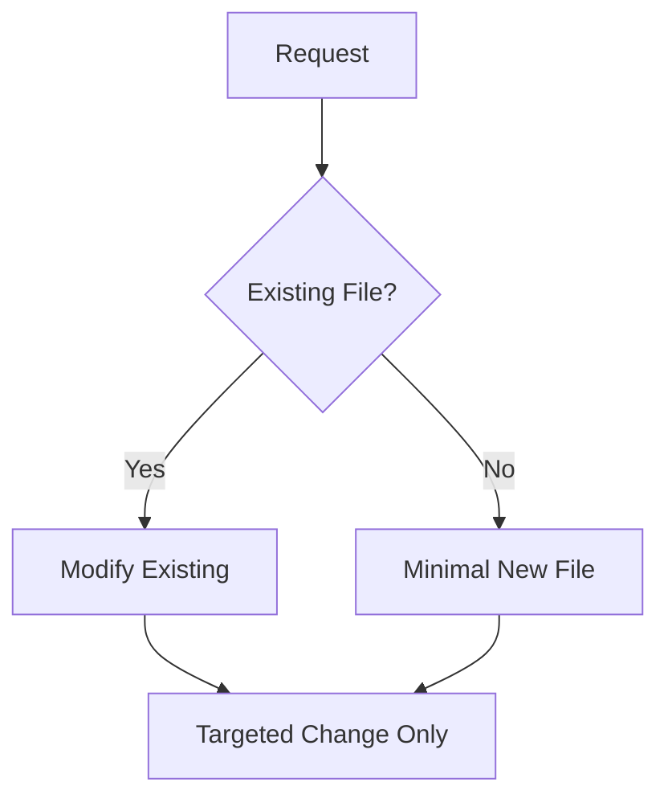

# Copilot Instructions

## Core Principles

### Stack
python venv for backend
nodejs/vite for frontend.

### Scope Control
- Execute only the explicitly requested task
- No feature additions beyond instruction
- No refactoring unless requested
- Ask before expanding scope

### File Operations
- Modify existing files over creating new ones
- One concern per file, keep files brief and focused
- Remove unnecessary content
- limit non-code files to essential instructions only

### Code Organization
use double quotes and backticks to escape labels in mermaid diagrams.

### Writing Style
- Eliminate paragraphs unless essential
- Use lists over prose
- Mermaid diagrams for complex relationships
- Code comments: why, not what

### Separation of Concerns
- **Backend**: `/server` - API, Neo4j queries, auth
- **Frontend**: `/client` - UI components, app state, events
- **Shared**: `/shared` - types, constants, utilities
- **Sprints**: `/sprint` - implementation notes and progress
- **Data**: Event tracking, eyetracking separate modules
- **README.md**: project overview, project status, and setup instructions
- **CONTINUE_HERE.md**: ongoing instructions with transitional state and next steps. remove any outdated info that does not ease transition between tasks or will not be parsed by future copilot requests.

### Change Pattern
1. Read relevant files
2. Make minimal, targeted edit
3. Verify change scope matches request
4. Test locally
5. (re)start the servers (kill and start)
6. Update CONTINUE_HERE.md with transitional state and next steps
7. Update the README if necessary
8. Commit completed features
9. Stop

### Version Control
- Commit after each completed logical unit
- Use conventional commits: `feat:`, `fix:`, `refactor:`, etc.
- Descriptive multi-line messages for complex changes
- Commit when todo tasks complete
- Stage all changes with `git add .`
- Use project root for git commands

### Prohibited
- Boilerplate beyond necessity
- Premature optimization
- Architectural changes without request
- Documentation paragraphs
- Example/demo code unless requested

### Required
- TypeScript types for Neo4j queries
- Event tracking contracts
- Component props interfaces
- API endpoint schemas

## Debugging
you can read the clients terminal output for the current debugging state.

Maintain a CONTINUE_HERE.md file for ongoing instructions and crucial work-in-progress state summary. When asked to continue, refer to CONTINUE_HERE.md for next steps. Upon completion of tasks, update the described transitional state and next actions in CONTINUE_HERE.md.